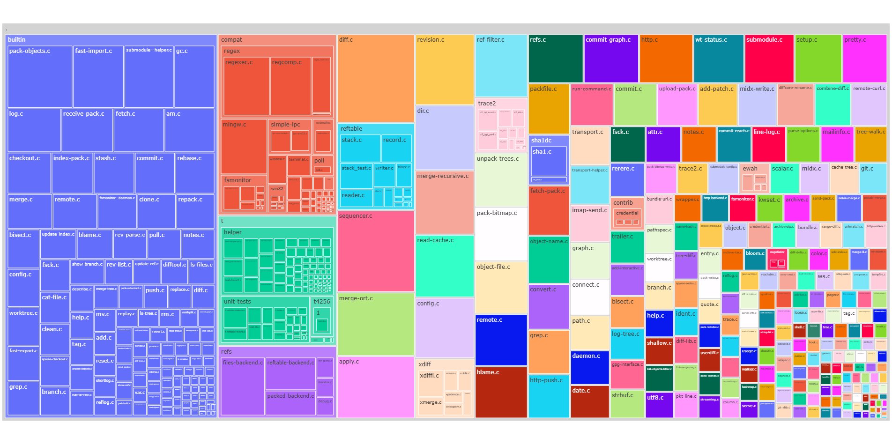
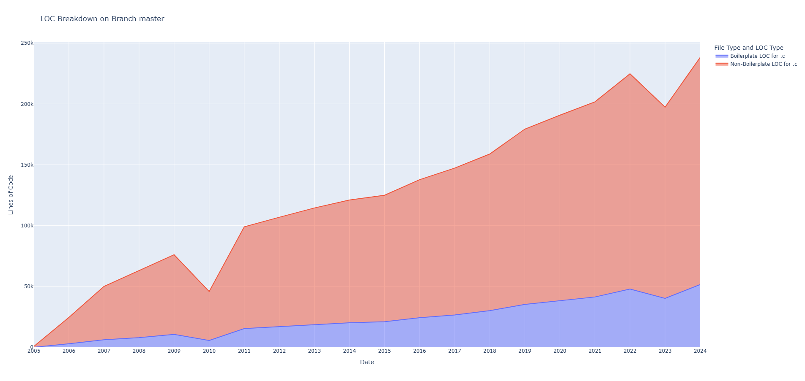

# codebase

Tools for understanding codebases.

### Install

```
pip install -r requirements.txt
```

## treemap.py

Creates a treemap of files in a directory based on lines of code.

Example:
```
python treemap.py data/git .c
```


## loc.c

Shows lines of code over time excluding whitespace and comments by default.
Divides code into boilerplate and non-boilerplate code.
The directory must be a Git repo.

Example:
```
python loc.py data/git master .c
```


##  cluster.py

Clusters similar files for detecting copy-pasted code.
Uses the OpenAI embedding API.

Example:
```
python cluster.py data/git .c
Computing embeddings for files...
Processing files: 100%|█████████████████████████████████████████████████████████████████████████████████| 587/587 [04:14<00:00,  2.31file/s, file=xutils.c] 
Clusters found:

Cluster 190:
  data/git\mailinfo.c
  data/git\t\t4256\1\mailinfo.c
  Lowest similarity in Cluster 190: 0.9687

Cluster 295:
  data/git\merge-ort.c
  data/git\merge-recursive.c
  Lowest similarity in Cluster 295: 0.9363

Cluster 321:
  data/git\midx-write.c
  data/git\midx.c
  Lowest similarity in Cluster 321: 0.9029
  ...
  ```